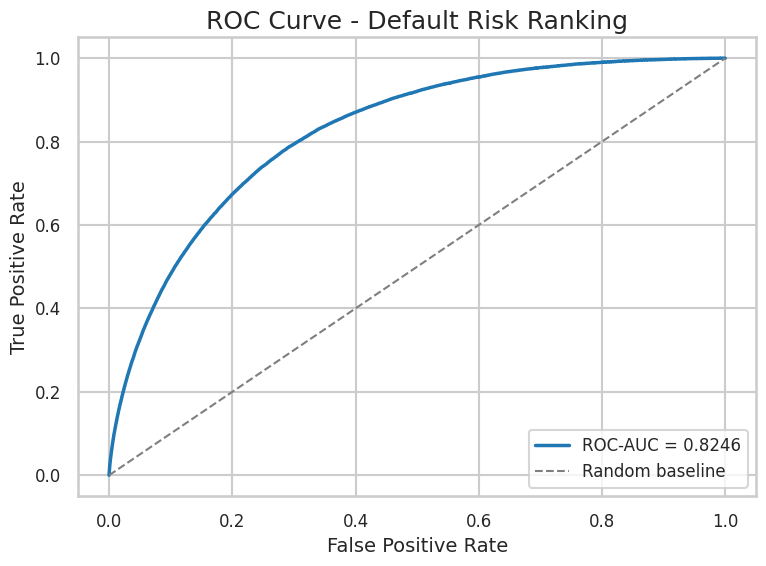

# 🏦 Loan Default Prediction using Machine Learning

> **A production-quality end-to-end machine learning project that predicts loan default risk using LightGBM, feature engineering, cross-validation, and explainable AI (SHAP).**

---

# 📌 Project Overview

Financial institutions lose billions of dollars every year due to loan defaults. Traditional rule-based credit approval systems often fail to capture complex relationships between borrower characteristics and repayment behavior.

This project develops a **machine learning-based credit risk prediction system** that estimates the probability of loan default, helping lenders make more informed lending decisions while minimizing financial risk.

Unlike a typical Kaggle competition notebook, this repository has been refactored into a **production-style data science project** with business-oriented documentation, model evaluation, explainability, and professional visualizations.

---

# 🎯 Business Problem

Banks and financial institutions need to answer one critical question:

> **"Will this customer default on the loan?"**

Incorrect decisions can lead to:

* Financial losses
* Increased Non-Performing Assets (NPA)
* Poor credit portfolio quality
* Reduced profitability

The objective of this project is to build a predictive model that accurately identifies high-risk borrowers before loan approval.

---

# 🎯 Business Objectives

* Predict customers likely to default on loans.
* Improve loan approval decisions.
* Reduce credit losses.
* Assist credit officers with data-driven risk assessment.
* Demonstrate how machine learning can support financial decision-making.

---

# 📂 Dataset

**Competition:** Home Credit - Credit Risk Model Stability (Kaggle)

The dataset contains customer demographic information, historical financial records, loan-related information, and behavioral variables.

Due to Kaggle licensing, the dataset is **not included** in this repository.

---

# 🛠️ Tech Stack

* Python
* Polars
* NumPy
* Pandas
* LightGBM
* Scikit-learn
* Matplotlib
* SHAP
* Jupyter Notebook

---

# 🔄 Machine Learning Pipeline

```
Raw Data
     │
     ▼
Data Cleaning
     │
     ▼
Feature Engineering
     │
     ▼
Cross Validation
     │
     ▼
LightGBM Training
     │
     ▼
Model Evaluation
     │
     ▼
SHAP Explainability
     │
     ▼
Business Insights
```

---

# ⚙️ Project Workflow

The notebook follows a complete end-to-end machine learning workflow:

* Data Loading
* Data Cleaning
* Feature Engineering
* Missing Value Handling
* Cross Validation
* LightGBM Model Training
* Model Evaluation
* Feature Importance Analysis
* SHAP Explainability
* Executive Summary

---

# 📊 Model Evaluation

The project includes comprehensive evaluation using:

* ROC-AUC Score
* Cross Validation
* Confusion Matrix
* ROC Curve
* Precision-Recall Curve
* Feature Importance
* SHAP Summary Plot
* SHAP Feature Importance
* Classification Report

These evaluation techniques provide both predictive performance and model interpretability.

---

# 📈 Model Performance

Cross Validation ROC-AUC:

```
Fold 1 : 0.8215
Fold 2 : 0.8219
Fold 3 : 0.8276
Fold 4 : 0.8283
Fold 5 : 0.8232
```

Average ROC-AUC:

```
0.8245
```

---

# 📊 Example Visualizations

This notebook automatically generates publication-quality figures including:

* ROC Curve

* Precision-Recall Curve
* Confusion Matrix
* Feature Importance
* SHAP Summary Plot
* SHAP Feature Importance

These images can be found in the **images/** directory after executing the notebook.

---

# 💡 Business Insights

This project demonstrates how machine learning can support real-world lending decisions by:

* Identifying high-risk loan applicants.
* Helping prioritize manual credit review.
* Reducing expected default rates.
* Improving portfolio quality.
* Supporting explainable AI for regulatory transparency.

Rather than replacing human decision-makers, the model serves as a **decision-support system** for credit analysts.

---

# 📁 Repository Structure

```
Loan-Default-Prediction/

│
├── loan-default-prediction-production-version.ipynb
├── README.md
├── requirements.txt
│
├── images/
│   ├── roc_curve.png
│   ├── precision_recall_curve.png
│   ├── confusion_matrix.png
│   ├── feature_importance.png
│   ├── shap_summary.png
│
└── outputs/
    └── sample_submission.csv
```

---

# 🚀 How to Run

Clone the repository:

```bash
git clone https://github.com/aniruddhapal/Loan-Default-Prediction-Production-version.git
```

Install dependencies:

```bash
pip install -r requirements.txt
```

Download the Kaggle dataset and update the dataset path if required.

Run the notebook from top to bottom.

---

# 🔮 Future Improvements

Potential enhancements include:

* Hyperparameter Optimization (Optuna)
* Model Ensembling
* Probability Calibration
* Cost-sensitive Learning
* MLflow Experiment Tracking
* Docker Deployment
* FastAPI Prediction Service
* Streamlit Web Application
* Automated Model Monitoring
* CI/CD Pipeline

---

# 📚 Key Learnings

Through this project I gained practical experience in:

* End-to-end machine learning workflows
* Credit risk modeling
* Production-quality notebook development
* Explainable AI using SHAP
* Feature engineering
* Cross-validation strategies
* Business-oriented model interpretation

---

# 📄 License

This project is intended for educational and portfolio purposes.

Please respect the Kaggle competition rules and dataset licensing.

---

# 👤 Author

**Aniruddha Pal**

GitHub: https://github.com/aniruddhapal

LinkedIn: https://www.linkedin.com/in/an1ruddhapal/

---

⭐ If you found this project interesting or useful, consider giving it a star.
